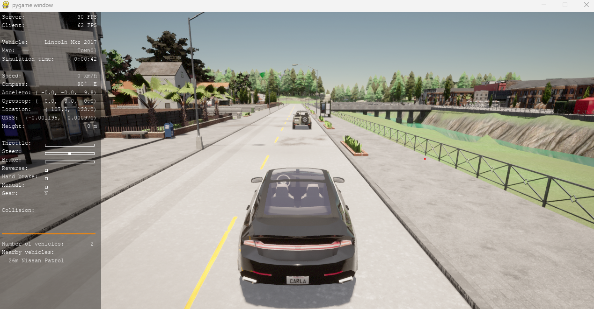

# Cyberattack Detection by Using a Discrete-Time Model-Based Unknown Input Observer

Code for the letter : https://ieeexplore.ieee.org/document/10536020?source=authoralert
 CACC , UIO  
https://youtu.be/CjGddM6lK9Y

2 Simulation :
 - Matlab
 - Python Carla

Enter to each folder for details how to run !!!  

# Citation 
@ARTICLE{10536020,
  author={Nguyen, Q. H. and Sadki, O. and Rafaralahy, H. and Haddad, M. and Zemouche, A.},
  journal={IEEE Control Systems Letters}, 
  title={Cyberattack Detection by Using a Discrete-Time Model-Based Unknown Input Observer}, 
  year={2024},
  volume={8},
  number={},
  pages={856-861},
  keywords={Uncertain systems;Sufficient conditions;Software algorithms;Observers;Software;Mathematical models;Cyberattack;Unknown input observer;Lyapunov stability;cyberattack;adaptive cruise control},
  doi={10.1109/LCSYS.2024.3403933}}

